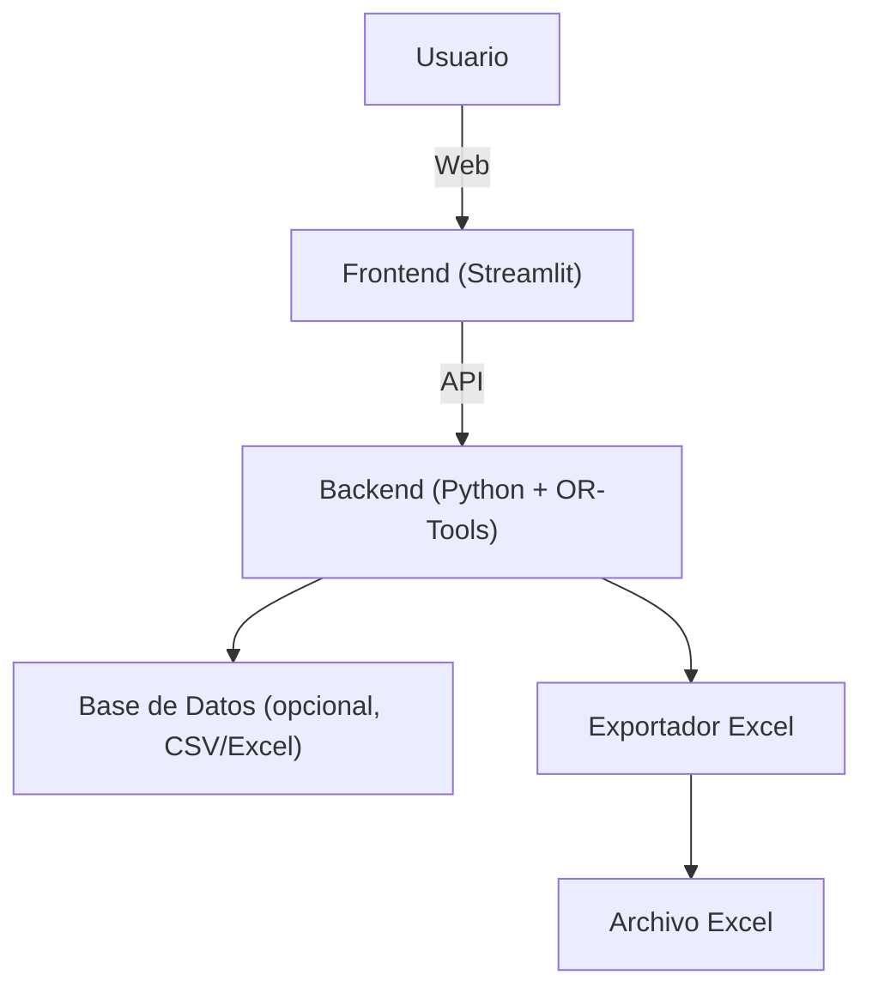
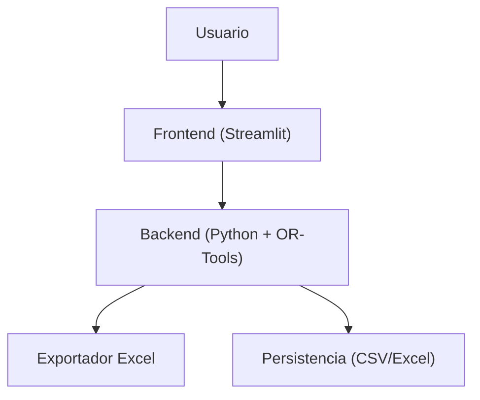

# Plan Maestro de Desarrollo: Planificador Automático de Turnos

---

## 1. Resumen Ejecutivo

Desarrollar una aplicación web que automatice la generación de horarios mensuales de turnos laborales, cumpliendo reglas de equidad y restricciones operativas, con exportación a Excel y una interfaz amigable.

---

## 2. Plan de Desarrollo Paso a Paso

### Fase 1: Análisis y Diseño
- Reunión de requisitos detallados con stakeholders.
- Modelado de datos: empleados, turnos, restricciones, preferencias.
- Diseño de la arquitectura técnica.
- Prototipo de interfaz (wireframes).

### Fase 2: Backend y Lógica de Optimización
- Implementación del modelo de datos en Python.
- Desarrollo del motor de optimización con Google OR-Tools.
- Pruebas unitarias de la lógica de asignación.
- Exportación básica a Excel.

### Fase 3: Interfaz de Usuario (Frontend)
- Desarrollo de la interfaz web (Streamlit o alternativa).
- Formularios para carga de datos y preferencias.
- Visualización de horarios generados.

### Fase 4: Integración y Exportación Avanzada
- Integración frontend-backend.
- Exportación avanzada a Excel (formato personalizado).
- Descarga de reportes y logs.

### Fase 5: Pruebas, Ajustes y Despliegue
- Pruebas funcionales y de usuario.
- Ajuste de parámetros y penalizaciones.
- Documentación y manual de usuario.
- Despliegue en entorno productivo.

---

## 3. Arquitectura Técnica del Sistema

- **Frontend**: Streamlit (rápido, Python nativo, ideal para prototipos y apps internas).
- **Backend**: Python, Google OR-Tools para la lógica de optimización.
- **Persistencia**: Inicialmente archivos CSV/Excel; opcionalmente una base de datos ligera (SQLite).
- **Exportación**: openpyxl/xlsxwriter para generar archivos Excel personalizados.

---

## 4. Especificaciones Funcionales

### 4.1. Gestión de Empleados
- Alta, baja y edición de empleados.
- Registro de certificaciones y habilidades.
- Carga de ausencias (vacaciones, permisos, etc.).

### 4.2. Gestión de Turnos
- Definición de tipos de turnos y requisitos.
- Asignación de turnos especializados a empleados calificados.

### 4.3. Preferencias y Restricciones
- Registro de preferencias de descanso y turnos.
- Gestión de restricciones duras (vacaciones, incapacidades, cobertura mínima, etc.).
- Gestión de restricciones suaves (preferencias, equidad).

### 4.4. Generación de Horario
- Algoritmo de optimización que respeta restricciones y maximiza equidad.
- Visualización del horario generado.
- Exportación a Excel con formato personalizado.

### 4.5. Reportes y Auditoría
- Reporte de cumplimiento de preferencias.
- Log de conflictos y decisiones del sistema.

---

## 5. Cronograma de Desarrollo por Fases

| Fase | Objetivo Principal | Duración Estimada | Entregables | Criterios de Éxito |
|------|-------------------|-------------------|-------------|--------------------|
| 1    | Análisis y Diseño | 1 semana          | Documento de requisitos, wireframes, modelo de datos | Validación de requisitos y modelo con stakeholders |
| 2    | Backend/Optimización | 2 semanas      | Motor de asignación funcional, pruebas unitarias, exportación básica | Generación de horarios válidos y exportación a Excel |
| 3    | Frontend          | 1 semana          | Interfaz web funcional, carga de datos, visualización | Usuario puede cargar datos y ver horarios |
| 4    | Integración/Exportación | 1 semana    | Exportación avanzada, integración completa | Descarga de horarios en formato final |
| 5    | Pruebas/Despliegue | 1 semana         | Pruebas, documentación, despliegue | Sistema estable, documentación lista |

---

## 6. Identificación de Riesgos y Dependencias

| Riesgo/Dependencia | Impacto | Mitigación |
|--------------------|---------|------------|
| Complejidad de restricciones | Alto | Modelar primero las reglas duras, luego las suaves. Probar con casos simples. |
| Cambios en requisitos | Medio | Reuniones frecuentes con stakeholders, prototipos tempranos. |
| Escalabilidad (muchos empleados/turnos) | Medio | Optimizar modelo, considerar hardware adecuado. |
| Exportación a Excel personalizada | Bajo | Usar librerías robustas (openpyxl, xlsxwriter). |
| Interfaz poco amigable | Bajo | Prototipar y validar con usuarios finales. |

---

## 7. Fases de Desarrollo y Criterios de Éxito

### Fase 1: Análisis y Diseño
- **Objetivo**: Entender requisitos y diseñar la solución.
- **Entregables**: Documento de requisitos, wireframes, modelo de datos.
- **Criterio de éxito**: Stakeholders validan el diseño.

### Fase 2: Backend y Optimización
- **Objetivo**: Motor de asignación funcional.
- **Entregables**: Script Python que genera horarios válidos y exporta a Excel.
- **Criterio de éxito**: Horarios cumplen restricciones duras y exportan correctamente.

### Fase 3: Frontend
- **Objetivo**: Interfaz web usable.
- **Entregables**: App Streamlit funcional.
- **Criterio de éxito**: Usuario puede cargar datos y ver horarios.

### Fase 4: Integración y Exportación
- **Objetivo**: Sistema integrado y exportación avanzada.
- **Entregables**: Descarga de horarios en formato final.
- **Criterio de éxito**: Horarios descargables y bien formateados.

### Fase 5: Pruebas y Despliegue
- **Objetivo**: Sistema estable y documentado.
- **Entregables**: Manual de usuario, sistema desplegado.
- **Criterio de éxito**: Usuarios finales pueden operar el sistema sin errores.

---

## 8. Proceso de Refinamiento

### Información Faltante / Ambigua
- ¿Cuántos tipos de turnos y cuáles son sus características exactas?
- ¿Cómo se definen los días festivos?
- ¿Qué formato exacto debe tener el archivo Excel de salida?
- ¿Qué nivel de personalización requiere la interfaz?
- ¿Se requiere autenticación de usuarios?
- ¿Se prevé integración con otros sistemas (RRHH, nómina)?

### Preguntas para Clarificar Funcionalidades
1. ¿Los empleados pueden tener múltiples certificaciones?
2. ¿Las preferencias de turno/día libre son fijas o pueden cambiar mes a mes?
3. ¿Qué ocurre si no se pueden cumplir todas las preferencias? ¿Hay prioridades?
4. ¿Se requiere historial de horarios generados?
5. ¿Qué datos deben ser editables por el usuario final?

### Alternativas de Implementación
- **Frontend**: Streamlit (rápido) vs. React+FastAPI (más robusto, más trabajo).
- **Persistencia**: Archivos CSV/Excel vs. base de datos (SQLite).
- **Exportación**: openpyxl (más flexible) vs. pandas.to_excel (más simple).

### Mejores Prácticas
- Modelar primero las restricciones duras, luego las suaves.
- Prototipar rápido y validar con usuarios.
- Documentar bien el modelo de datos y las reglas.
- Mantener el código modular y testeable.
- Usar control de versiones (Git).

---

## 9. Ejemplo de Funcionalidad

- **Carga de empleados**: El usuario sube un archivo Excel con nombre, certificaciones, preferencias y ausencias.
- **Generación de horario**: El sistema genera el horario y muestra un resumen de cumplimiento de preferencias.
- **Exportación**: El usuario descarga el horario en un archivo Excel con formato personalizado.

---

## 10. Diagramas

### Diagrama de Componentes

---

## 11. Conclusión

Este documento sirve como hoja de ruta integral para el desarrollo del sistema de turnos. Cada fase tiene objetivos claros, entregables y criterios de éxito. Se identifican riesgos y dependencias, y se proponen alternativas y mejores prácticas para asegurar el éxito del proyecto. 